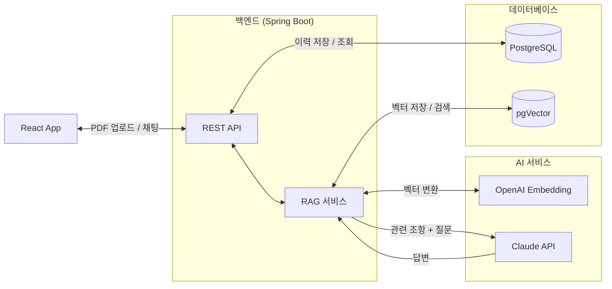
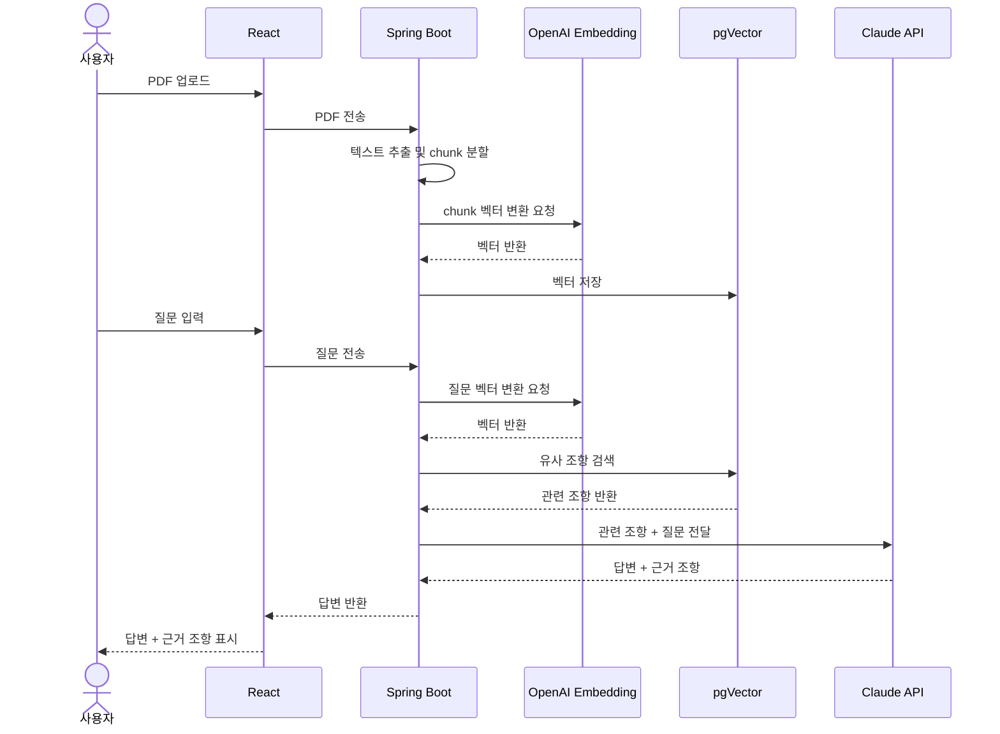

# 시스템 아키텍처

## 전체 구조

```mermaid
graph LR
    UI[React App]

    subgraph Server["백엔드 (Spring Boot)"]
        API[REST API]
        RAG[RAG 서비스]
    end

    subgraph AI["AI 서비스"]
        EMBED[OpenAI Embedding]
        LLM[Claude API]
    end

    subgraph DB["데이터베이스"]
        PG[(PostgreSQL)]
        VEC[(pgVector)]
    end

    UI <-->|"PDF 업로드 / 채팅"| API
    API <--> RAG
    RAG <-->|"벡터 변환"| EMBED
    RAG <-->|"벡터 저장 / 검색"| VEC
    RAG -->|"관련 조항 + 질문"| LLM
    LLM -->|"답변"| RAG
    API <-->|"이력 저장 / 조회"| PG
```

## RAG 처리 흐름

```mermaid
sequenceDiagram
    actor User as 사용자
    participant FE as React
    participant BE as Spring Boot
    participant OAI as OpenAI Embedding
    participant VEC as pgVector
    participant Claude as Claude API

    User->>FE: PDF 업로드
    FE->>BE: PDF 전송
    BE->>BE: 텍스트 추출 및 chunk 분할
    BE->>OAI: chunk 벡터 변환 요청
    OAI-->>BE: 벡터 반환
    BE->>VEC: 벡터 저장

    User->>FE: 질문 입력
    FE->>BE: 질문 전송
    BE->>OAI: 질문 벡터 변환 요청
    OAI-->>BE: 벡터 반환
    BE->>VEC: 유사 조항 검색
    VEC-->>BE: 관련 조항 반환
    BE->>Claude: 관련 조항 + 질문 전달
    Claude-->>BE: 답변 + 근거 조항
    BE-->>FE: 답변 반환
    FE-->>User: 답변 + 근거 조항 표시
```