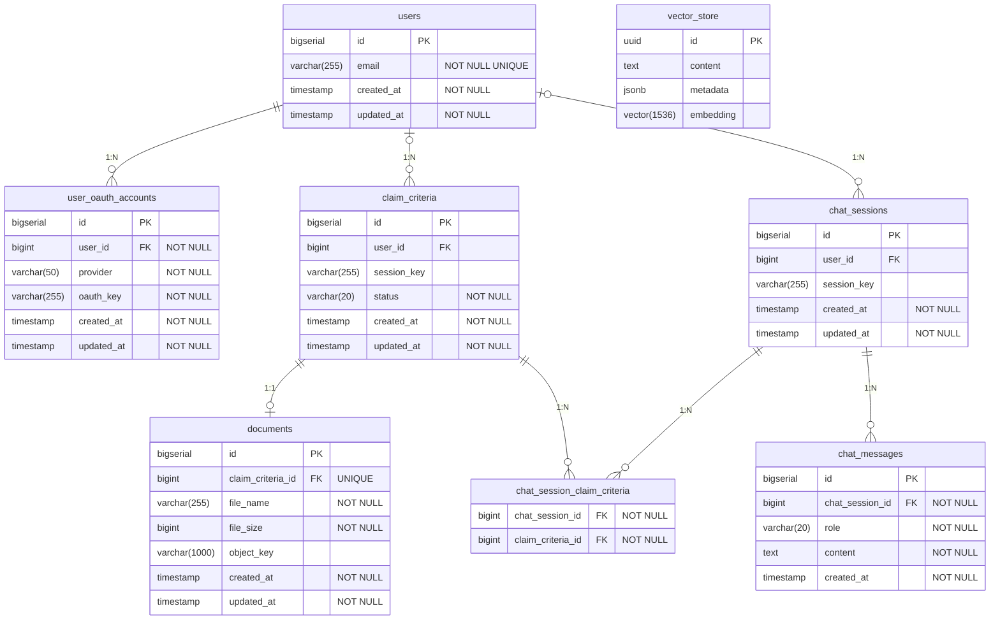

# DB 설계 문서

작성일: 2026-04-27  
최종 수정: 2026-05-26

---

## 1. 설계 원칙

- **로그인/비로그인 공통**: 동일한 테이블 사용. 구분자는 `user_id` vs `session_key`.
- **로그인 사용자**: `user_id`로 식별, 데이터 영구 저장.
- **비로그인 사용자**: `session_key`(HTTP 세션 ID)로 식별, 세션 만료 시 관련 데이터 일괄 삭제.
- **개인정보(나이, 성별)**: 별도 컬럼 없이 `chat_messages` 대화 이력에서 AI가 맥락 파악.
- **PDF 파일**: S3(LocalStack)에 저장. 오브젝트 키는 `documents.object_key`에 기록. 추출한 chunk는 `vector_store`에 보관.
- **vector_store**: Spring AI `PgVectorStore` 자동 관리 — JPA 엔티티로 직접 매핑하지 않음.
- **PK 전략**: BIGSERIAL (autoincrement) — DB가 생성. 외부 공개 ID로 그대로 사용.
- **OAuth**: `user_oauth_accounts` 테이블로 분리해 다중 프로바이더 지원.
- **도메인/파일 분리**: `claim_criteria`(보험 약관 도메인) + `documents`(파일 메타데이터) 1:1.
- **FK 연쇄 삭제**: 도메인 테이블 FK는 `ON DELETE CASCADE`를 쓰지 않는다(기본 NO ACTION). 연쇄 삭제는 애플리케이션이 자식 → 부모 순서로 명시 수행한다. (단, Spring Session 스키마는 예외 — 프레임워크가 cascade에 의존)

---

## 2. ERD



---

## 3. 테이블 정의

### 3.1 users

| 컬럼 | 타입 | NOT NULL | UNIQUE | 설명 |
|------|------|:--------:|:------:|------|
| `id` | BIGSERIAL | ✓ | ✓ | PK, DB 자동 생성 |
| `email` | VARCHAR(255) | ✓ | ✓ | 계정 이메일 |
| `created_at` | TIMESTAMP | ✓ | | 가입일 |
| `updated_at` | TIMESTAMP | ✓ | | 최종 수정일 |

```sql
CREATE TABLE users (
    id         BIGSERIAL    PRIMARY KEY,
    email      VARCHAR(255) NOT NULL UNIQUE,
    created_at TIMESTAMP    NOT NULL DEFAULT now(),
    updated_at TIMESTAMP    NOT NULL DEFAULT now()
);
```

---

### 3.2 user_oauth_accounts

OAuth 프로바이더별 계정 정보. 다중 프로바이더(Google, Kakao 등) 지원.

| 컬럼 | 타입 | NOT NULL | 설명 |
|------|------|:--------:|------|
| `id` | BIGSERIAL | ✓ | PK |
| `user_id` | BIGINT | ✓ | FK → users.id |
| `provider` | VARCHAR(50) | ✓ | 프로바이더 식별자 ('google', 'kakao' 등) |
| `oauth_key` | VARCHAR(255) | ✓ | 프로바이더가 발급한 subject ID (예: google_sub) |
| `created_at` | TIMESTAMP | ✓ | |
| `updated_at` | TIMESTAMP | ✓ | |

> `(provider, oauth_key)` 복합 유니크 제약.

```sql
CREATE TABLE user_oauth_accounts (
    id         BIGSERIAL    PRIMARY KEY,
    user_id    BIGINT       NOT NULL REFERENCES users(id),
    provider   VARCHAR(50)  NOT NULL,
    oauth_key  VARCHAR(255) NOT NULL,
    created_at TIMESTAMP    NOT NULL DEFAULT now(),
    updated_at TIMESTAMP    NOT NULL DEFAULT now(),
    CONSTRAINT uq_user_oauth_provider_key UNIQUE (provider, oauth_key)
);
CREATE INDEX idx_user_oauth_accounts_user_id ON user_oauth_accounts(user_id);
```

---

### 3.3 claim_criteria

보험 약관 도메인 개념. 파일 메타데이터는 `documents`로 분리.

> `user_id`와 `session_key` 중 반드시 하나만 존재 (CHECK 제약).

| 컬럼 | 타입 | NOT NULL | 설명 |
|------|------|:--------:|------|
| `id` | BIGSERIAL | ✓ | PK |
| `user_id` | BIGINT | - | FK → users.id, 로그인 사용자만 |
| `session_key` | VARCHAR(255) | - | 비로그인 HTTP 세션 ID |
| `status` | VARCHAR(20) | ✓ | PENDING / PROCESSING / COMPLETED / FAILED |
| `created_at` | TIMESTAMP | ✓ | |
| `updated_at` | TIMESTAMP | ✓ | |

```sql
CREATE TABLE claim_criteria (
    id          BIGSERIAL    PRIMARY KEY,
    user_id     BIGINT       REFERENCES users(id),
    session_key VARCHAR(255),
    status      VARCHAR(20)  NOT NULL DEFAULT 'PENDING',
    created_at  TIMESTAMP    NOT NULL DEFAULT now(),
    updated_at  TIMESTAMP    NOT NULL DEFAULT now(),
    CONSTRAINT chk_claim_criteria_owner
        CHECK (
            (user_id IS NOT NULL AND session_key IS NULL) OR
            (user_id IS NULL AND session_key IS NOT NULL)
        )
);
CREATE INDEX idx_claim_criteria_user_id     ON claim_criteria(user_id);
CREATE INDEX idx_claim_criteria_session_key ON claim_criteria(session_key);
```

---

### 3.4 documents

파일 메타데이터. `claim_criteria`와 1:1. `object_key`는 S3 오브젝트 키.

| 컬럼 | 타입 | NOT NULL | 설명 |
|------|------|:--------:|------|
| `id` | BIGSERIAL | ✓ | PK |
| `claim_criteria_id` | BIGINT | ✓ | FK → claim_criteria.id (UNIQUE — 1:1 보장) |
| `file_name` | VARCHAR(255) | ✓ | 원본 파일명 |
| `file_size` | BIGINT | ✓ | 파일 크기 (bytes) |
| `object_key` | VARCHAR(1000) | - | S3 오브젝트 키 (업로드 완료 후 설정) |
| `created_at` | TIMESTAMP | ✓ | |
| `updated_at` | TIMESTAMP | ✓ | |

```sql
CREATE TABLE documents (
    id                BIGSERIAL     PRIMARY KEY,
    claim_criteria_id BIGINT        NOT NULL UNIQUE REFERENCES claim_criteria(id),
    file_name         VARCHAR(255)  NOT NULL,
    file_size         BIGINT        NOT NULL,
    object_key        VARCHAR(1000),
    created_at        TIMESTAMP     NOT NULL DEFAULT now(),
    updated_at        TIMESTAMP     NOT NULL DEFAULT now()
);
```

---

### 3.5 chat_sessions

채팅 세션 단위. 하나의 세션에서 여러 약관을 참조할 수 있음.

> `user_id`와 `session_key` 중 반드시 하나만 존재 (CHECK 제약).

| 컬럼 | 타입 | NOT NULL | 설명 |
|------|------|:--------:|------|
| `id` | BIGSERIAL | ✓ | PK |
| `user_id` | BIGINT | - | FK → users.id, 로그인 사용자만 |
| `session_key` | VARCHAR(255) | - | 비로그인 HTTP 세션 ID |
| `created_at` | TIMESTAMP | ✓ | |
| `updated_at` | TIMESTAMP | ✓ | |

```sql
CREATE TABLE chat_sessions (
    id          BIGSERIAL    PRIMARY KEY,
    user_id     BIGINT       REFERENCES users(id),
    session_key VARCHAR(255),
    created_at  TIMESTAMP    NOT NULL DEFAULT now(),
    updated_at  TIMESTAMP    NOT NULL DEFAULT now(),
    CONSTRAINT chk_chat_sessions_owner
        CHECK (
            (user_id IS NOT NULL AND session_key IS NULL) OR
            (user_id IS NULL AND session_key IS NOT NULL)
        )
);
CREATE INDEX idx_chat_sessions_user_id     ON chat_sessions(user_id);
CREATE INDEX idx_chat_sessions_session_key ON chat_sessions(session_key);
```

---

### 3.6 chat_session_claim_criteria

채팅 세션과 약관의 M:N 중간 테이블.

| 컬럼 | 타입 | NOT NULL | 설명 |
|------|------|:--------:|------|
| `chat_session_id` | BIGINT | ✓ | PK, FK → chat_sessions.id |
| `claim_criteria_id` | BIGINT | ✓ | PK, FK → claim_criteria.id |

```sql
CREATE TABLE chat_session_claim_criteria (
    chat_session_id   BIGINT NOT NULL REFERENCES chat_sessions(id),
    claim_criteria_id BIGINT NOT NULL REFERENCES claim_criteria(id),
    PRIMARY KEY (chat_session_id, claim_criteria_id)
);
```

---

### 3.7 chat_messages

세션 내 메시지. 수정 기능 없으므로 `updated_at` 없음.

| 컬럼 | 타입 | NOT NULL | 설명 |
|------|------|:--------:|------|
| `id` | BIGSERIAL | ✓ | PK |
| `chat_session_id` | BIGINT | ✓ | FK → chat_sessions.id |
| `role` | VARCHAR(20) | ✓ | 'USER' 또는 'ASSISTANT' |
| `content` | TEXT | ✓ | 메시지 본문 |
| `created_at` | TIMESTAMP | ✓ | |

```sql
CREATE TABLE chat_messages (
    id              BIGSERIAL   PRIMARY KEY,
    chat_session_id BIGINT      NOT NULL REFERENCES chat_sessions(id),
    role            VARCHAR(20) NOT NULL,
    content         TEXT        NOT NULL,
    created_at      TIMESTAMP   NOT NULL DEFAULT now()
);
CREATE INDEX idx_chat_messages_chat_session_id ON chat_messages(chat_session_id);
```

---

### 3.8 vector_store (Spring AI 자동 관리)

Spring AI `PgVectorStore`가 자동 생성. `metadata`에 `claim_criteria_id`를 저장해 논리적으로 연결.

> FK 제약 없음. `claim_criteria` 삭제 시 애플리케이션 레벨에서 해당 `claim_criteria_id`의 chunk를 직접 삭제해야 함.

| 컬럼 | 타입 | 설명 |
|------|------|------|
| `id` | UUID | PK |
| `content` | TEXT | chunk 원문 텍스트 |
| `metadata` | JSONB | `{"claim_criteria_id": "<id>"}` |
| `embedding` | VECTOR(1536) | OpenAI text-embedding-ada-002 기준 |

```sql
CREATE EXTENSION IF NOT EXISTS vector;

CREATE TABLE IF NOT EXISTS vector_store (
    id        UUID PRIMARY KEY DEFAULT gen_random_uuid(),
    content   TEXT,
    metadata  JSONB,
    embedding VECTOR(1536)
);

CREATE INDEX ON vector_store USING HNSW (embedding vector_cosine_ops);
```

---

## 4. 데이터 흐름

### PDF 업로드 및 벡터 저장
```
PDF 업로드
  → claim_criteria 레코드 생성 (status: PENDING)
  → documents 레코드 생성 (file_name, file_size 저장)
  → S3 업로드 → documents.object_key 업데이트
  → 텍스트 추출 및 chunk 분할
  → OpenAI Embedding API로 벡터 변환
  → vector_store에 저장 (metadata: {"claim_criteria_id": "<id>"})
  → claim_criteria.status → COMPLETED
```

### 채팅
```
사용자가 약관 선택 (체크박스)
  → chat_session_claim_criteria에 (chat_session_id, claim_criteria_id) 저장
  → 질문 입력 → 벡터 변환
  → vector_store에서 선택된 claim_criteria_id로 필터링 후 유사 chunk 검색
  → 검색된 chunk + 대화 이력 + 질문 → Claude API → 답변
  → chat_messages에 저장 (role: USER / ASSISTANT)
```

### 비로그인 세션 만료
```
브라우저 종료 → HTTP 세션 만료
  → 애플리케이션이 자식 → 부모 순서로 명시 삭제 (FK cascade 미사용)
    chat_session_claim_criteria 링크 → documents → claim_criteria
  → vector_store에서 claim_criteria_id로 chunk 삭제 (애플리케이션 처리)
```