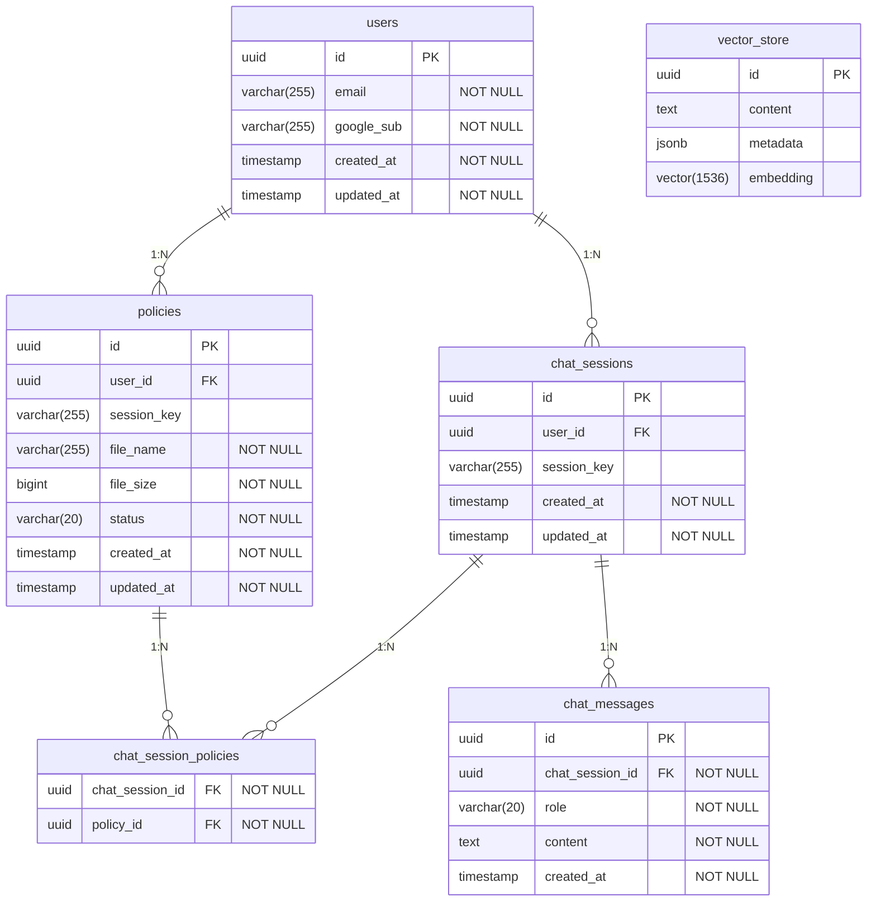

# DB 설계 문서

작성일: 2026-04-27

---

## 1. 설계 원칙

- **로그인/비로그인 공통**: 동일한 테이블 사용. 구분자는 `user_id` vs `session_key`.
- **로그인 사용자**: `user_id`로 식별, 데이터 영구 저장.
- **비로그인 사용자**: `session_key`(HTTP 세션 ID)로 식별, 세션 만료 시 관련 데이터 일괄 삭제.
- **개인정보(나이, 성별)**: 별도 컬럼 없이 `chat_messages` 대화 이력에서 AI가 맥락 파악.
- **로그인 사용자 신규 대화**: 이전 `chat_messages`에서 개인정보 맥락을 추출해 주입.
- **PDF 파일**: 서버에 저장하지 않음. 추출한 chunk만 `vector_store`에 보관.
- **vector_store**: Spring AI `PgVectorStore` 자동 관리 — JPA 엔티티로 직접 매핑하지 않음.

---

## 2. ERD



---

## 3. 테이블 정의

### 3.1 users

| 컬럼 | 타입 | NOT NULL | UNIQUE | 설명 |
|------|------|:--------:|:------:|------|
| `id` | UUID | ✓ | ✓ | PK, 서버 생성 |
| `email` | VARCHAR(255) | ✓ | ✓ | Google 계정 이메일 |
| `google_sub` | VARCHAR(255) | ✓ | ✓ | Google OAuth 고유 ID (이메일 변경에 대응) |
| `created_at` | TIMESTAMP | ✓ | | 가입일 |
| `updated_at` | TIMESTAMP | ✓ | | 최종 수정일 |

```sql
CREATE TABLE users (
    id         UUID         PRIMARY KEY,
    email      VARCHAR(255) NOT NULL UNIQUE,
    google_sub VARCHAR(255) NOT NULL UNIQUE,
    created_at TIMESTAMP    NOT NULL DEFAULT now(),
    updated_at TIMESTAMP    NOT NULL DEFAULT now()
);
```

---

### 3.2 policies

PDF 메타정보 저장. 파일 자체는 저장하지 않고 chunk는 `vector_store`에 보관.

> `user_id`와 `session_key` 중 반드시 하나만 존재 (CHECK 제약).

| 컬럼 | 타입 | NOT NULL | 설명 |
|------|------|:--------:|------|
| `id` | UUID | ✓ | PK, 서버 생성 |
| `user_id` | UUID | - | FK → users.id, 로그인 사용자만 |
| `session_key` | VARCHAR(255) | - | 비로그인 HTTP 세션 ID |
| `file_name` | VARCHAR(255) | ✓ | 원본 파일명 |
| `file_size` | BIGINT | ✓ | 파일 크기 (bytes) |
| `status` | VARCHAR(20) | ✓ | PENDING / PROCESSING / COMPLETED / FAILED |
| `created_at` | TIMESTAMP | ✓ | |
| `updated_at` | TIMESTAMP | ✓ | |

```sql
CREATE TABLE policies (
    id          UUID         PRIMARY KEY,
    user_id     UUID         REFERENCES users(id) ON DELETE CASCADE,
    session_key VARCHAR(255),
    file_name   VARCHAR(255) NOT NULL,
    file_size   BIGINT       NOT NULL,
    status      VARCHAR(20)  NOT NULL DEFAULT 'PENDING',
    created_at  TIMESTAMP    NOT NULL DEFAULT now(),
    updated_at  TIMESTAMP    NOT NULL DEFAULT now(),

    CONSTRAINT chk_policies_owner
        CHECK (
            (user_id IS NOT NULL AND session_key IS NULL) OR
            (user_id IS NULL AND session_key IS NOT NULL)
        )
);

CREATE INDEX idx_policies_user_id     ON policies(user_id);
CREATE INDEX idx_policies_session_key ON policies(session_key);
```

---

### 3.3 chat_sessions

채팅 세션 단위. 하나의 세션에서 여러 PDF를 참조할 수 있음.

> `user_id`와 `session_key` 중 반드시 하나만 존재 (CHECK 제약).

| 컬럼 | 타입 | NOT NULL | 설명 |
|------|------|:--------:|------|
| `id` | UUID | ✓ | PK, 서버 생성 |
| `user_id` | UUID | - | FK → users.id, 로그인 사용자만 |
| `session_key` | VARCHAR(255) | - | 비로그인 HTTP 세션 ID |
| `created_at` | TIMESTAMP | ✓ | |
| `updated_at` | TIMESTAMP | ✓ | |

```sql
CREATE TABLE chat_sessions (
    id          UUID         PRIMARY KEY,
    user_id     UUID         REFERENCES users(id) ON DELETE CASCADE,
    session_key VARCHAR(255),
    created_at  TIMESTAMP    NOT NULL DEFAULT now(),
    updated_at  TIMESTAMP    NOT NULL DEFAULT now(),

    CONSTRAINT chk_chat_sessions_owner
        CHECK (
            (user_id IS NOT NULL AND session_key IS NULL) OR
            (user_id IS NULL AND session_key IS NOT NULL)
        )
);

CREATE INDEX idx_chat_sessions_user_id     ON chat_sessions(user_id);
CREATE INDEX idx_chat_sessions_session_key ON chat_sessions(session_key);
```

---

### 3.4 chat_session_policies

채팅 세션과 PDF의 M:N 중간 테이블. 세션마다 참조하는 PDF 목록을 관리.

| 컬럼 | 타입 | NOT NULL | 설명 |
|------|------|:--------:|------|
| `chat_session_id` | UUID | ✓ | PK, FK → chat_sessions.id |
| `policy_id` | UUID | ✓ | PK, FK → policies.id |

```sql
CREATE TABLE chat_session_policies (
    chat_session_id UUID NOT NULL REFERENCES chat_sessions(id) ON DELETE CASCADE,
    policy_id       UUID NOT NULL REFERENCES policies(id) ON DELETE CASCADE,

    PRIMARY KEY (chat_session_id, policy_id)
);
```

---

### 3.5 chat_messages

세션 내 메시지. 수정 기능 없으므로 `updated_at` 없음.

| 컬럼 | 타입 | NOT NULL | 설명 |
|------|------|:--------:|------|
| `id` | UUID | ✓ | PK, 서버 생성 |
| `chat_session_id` | UUID | ✓ | FK → chat_sessions.id |
| `role` | VARCHAR(20) | ✓ | 'USER' 또는 'ASSISTANT' |
| `content` | TEXT | ✓ | 메시지 본문 |
| `created_at` | TIMESTAMP | ✓ | |

```sql
CREATE TABLE chat_messages (
    id              UUID        PRIMARY KEY,
    chat_session_id UUID        NOT NULL REFERENCES chat_sessions(id) ON DELETE CASCADE,
    role            VARCHAR(20) NOT NULL,
    content         TEXT        NOT NULL,
    created_at      TIMESTAMP   NOT NULL DEFAULT now()
);

CREATE INDEX idx_chat_messages_chat_session_id ON chat_messages(chat_session_id);
```

---

### 3.6 vector_store (Spring AI 자동 관리)

Spring AI `PgVectorStore`가 자동 생성. `metadata`에 `policy_id`를 저장해 논리적으로 연결.

> FK 제약 없음. `policies` 삭제 시 애플리케이션 레벨에서 해당 `policy_id`의 chunk를 직접 삭제해야 함.

| 컬럼 | 타입 | 설명 |
|------|------|------|
| `id` | UUID | PK |
| `content` | TEXT | chunk 원문 텍스트 |
| `metadata` | JSONB | `{"policy_id": "<uuid>"}` |
| `embedding` | VECTOR(1536) | OpenAI text-embedding-ada-002 기준 |

```sql
CREATE EXTENSION IF NOT EXISTS vector;

CREATE TABLE IF NOT EXISTS vector_store (
    id        UUID PRIMARY KEY DEFAULT gen_random_uuid(),
    content   TEXT,
    metadata  JSONB,
    embedding VECTOR(1536)
);

CREATE INDEX ON vector_store USING HNSW (embedding vector_cosine_ops);
```

---

## 4. 데이터 흐름

### PDF 업로드 및 벡터 저장
```
PDF 업로드
  → policies 레코드 생성 (status: PENDING)
  → 텍스트 추출 및 chunk 분할
  → OpenAI Embedding API로 벡터 변환
  → vector_store에 저장 (metadata: {"policy_id": "<id>"})
  → policies.status → COMPLETED
```

### 채팅
```
사용자가 PDF 선택 (체크박스)
  → chat_session_policies에 (chat_session_id, policy_id) 저장
  → 질문 입력 → 벡터 변환
  → vector_store에서 선택된 policy_id로 필터링 후 유사 chunk 검색
  → 검색된 chunk + 대화 이력 + 질문 → Claude API → 답변
  → chat_messages에 저장 (role: USER / ASSISTANT)
```

### 비로그인 세션 만료
```
브라우저 종료 → HTTP 세션 만료
  → DELETE FROM policies WHERE session_key = 'abc'
    (ON DELETE CASCADE → chat_sessions → chat_messages 자동 삭제)
  → vector_store에서 policy_id로 chunk 삭제 (애플리케이션 처리)
```