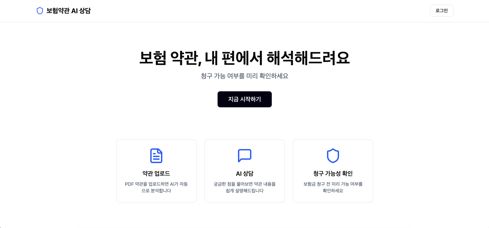
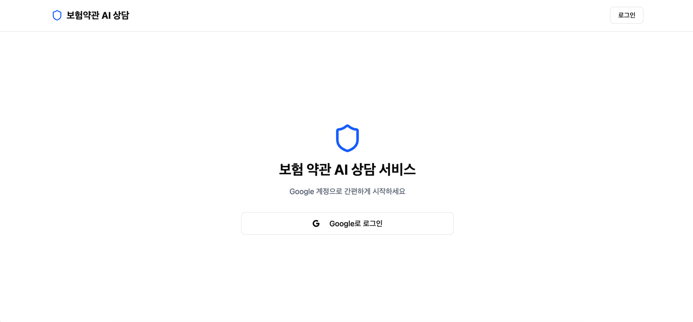
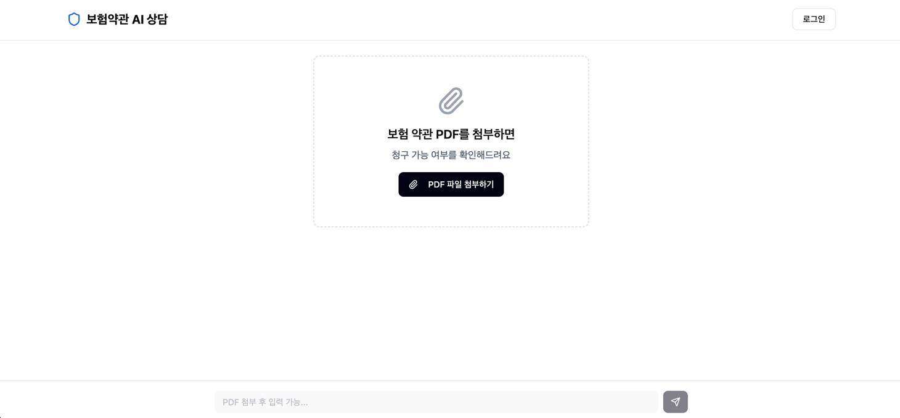
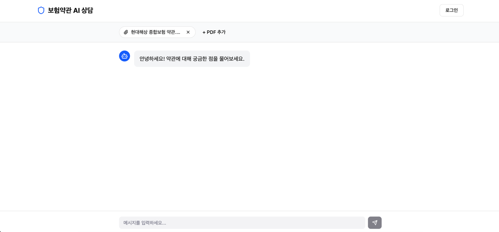
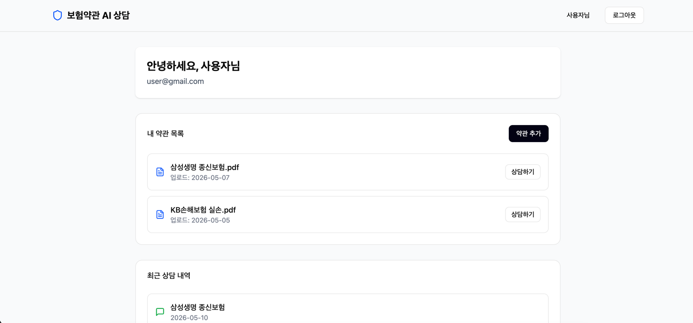
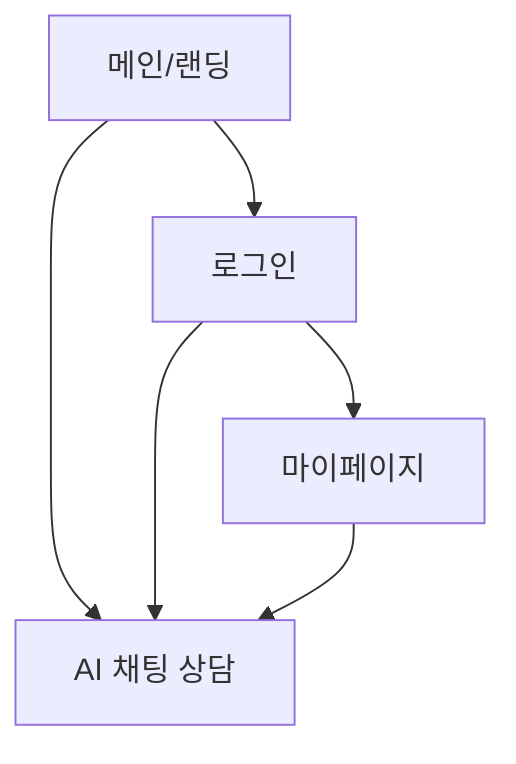

# 화면 기획서

## Figma

https://www.figma.com/make/hOdTkxkOENUznC7PfPt2eh/Screen-Design-Document?fullscreen=1&t=A7PGwRQX7BXVbT4t-1&code-node-id=0-9

## 화면 목록

| 화면 | 경로 | 비로그인 접근 |
|------|------|:------------:|
| 메인/랜딩 | `/` | O |
| 로그인 | `/login` | O |
| AI 채팅 상담 | `/chat/{sessionId}` | O |
| 마이페이지 | `/mypage` | X |

---

## 화면 스크린샷

### 메인 (`/`)


### 로그인 (`/login`)


### AI 채팅 상담 - State A (`/chat/{sessionId}`)


### AI 채팅 상담 - State B (`/chat/{sessionId}`)


### 마이페이지 (`/mypage`)


---

## 화면 흐름



---

## 화면별 와이어프레임

### 1. 메인/랜딩 (`/`)

```
┌────────────────────────────────────┐
│  [로고]                 [로그인]      │
├────────────────────────────────────┤
│                                    │
│   보험 약관, 내 편에서 해석해드려요        │
│   청구 가능 여부를 미리 확인하세요         │
│                                    │
│         [지금 시작하기]               │
│                                    │
└────────────────────────────────────┘
```

---

### 2. AI 채팅 상담 (`/chat/{sessionId}`)

**State A: PDF 미첨부 (처음 진입)**

```
┌────────────────────────────────────┐
│  [로고]                  [로그인]     │
├────────────────────────────────────┤
│                                    │
│  ┌──────────────────────────────┐  │
│  │  보험 약관 PDF를 첨부하면         │  │
│  │  청구 가능 여부를 확인해드려요      │  │
│  │                              │  │
│  │    [📎 PDF 파일 첨부하기]       │  │
│  └──────────────────────────────┘  │
│                                    │
├────────────────────────────────────┤
│  [PDF 첨부 후 입력 가능...]            │
└────────────────────────────────────┘
```

**State B: PDF 첨부 후 대화 중**

```
┌────────────────────────────────────┐
│  [로고]                  [로그인]     │
├────────────────────────────────────┤
│  📎 삼성생명.pdf ✕  KB손보.pdf ✕      │
│     [+ PDF 추가]                    │
├────────────────────────────────────┤
│                                    │
│  AI: 안녕하세요! 약관에 대해            │
│      궁금한 점을 물어보세요.            │
│                                    │
│              사용자: 암 진단비         │
│              청구 가능한가요?          │
│                                    │
│  AI: 해당 약관 3조 2항에 따르면...      │
│                                    │
├────────────────────────────────────┤
│  [메시지 입력...]        [전송]        │
└────────────────────────────────────┘
```

---

### 3. 로그인 (`/login`)

```
┌────────────────────────────────────┐
│  [로고]                             │
├────────────────────────────────────┤
│                                    │
│   보험 약관 AI 상담 서비스              │
│                                    │
│  ┌──────────────────────────────┐  │
│  │  G  Google로 로그인            │  │
│  └──────────────────────────────┘  │
│                                    │
└────────────────────────────────────┘
```

---

### 4. 마이페이지 (`/mypage`)

```
┌────────────────────────────────────┐
│  [로고]                  [로그아웃]   │
├────────────────────────────────────┤
│  안녕하세요, {이름}님                  │
├────────────────────────────────────┤
│  내 약관 목록                         │
│  ├ 삼성생명 종신보험.pdf  [상담하기]      │
│  └ KB손해보험 실손.pdf   [상담하기]      │
├────────────────────────────────────┤
│  최근 상담 내역                       │
│  ├ 2026-05-10  삼성생명 종신보험       │
│  └ 2026-05-08  KB손해보험 실손        │
└────────────────────────────────────┘
```